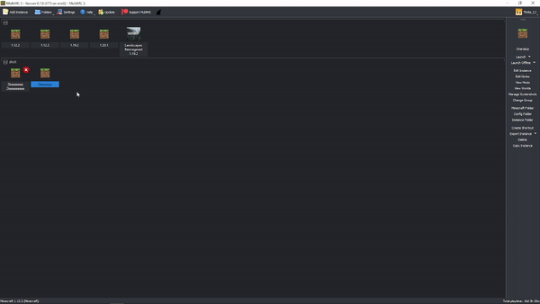

# Oneratus

A full minecraft client loader for 1.12.2 forge using tweak class and remote class loading. Now supports Mixins!

## Usage

### Structure

* `Loader` – This module loads the client code from the server
* `Client` – the client code, This gets loaded from the server using the loader when the game starts.
* `Server` – Authenticating hwid, sends client.jar in return if valid
* `installer` – installs the library jar and edits the version.json files (adds tweak class)

### Development

#### Client

You don't need to have a `IFMLLoadingPlugin` in your client code, the loader will handle that for you.
All you need to do is add your normal client code to the `Client` module. Make sure to add any mixins to
the `mixins.client.json` file.

#### Loader

All you will have to do in the loader is change the ip and port in the `Loader.java` file to your server's ip and port.

#### Server

To run the server, you have to provide the client jar in the cli.

```bash
java -jar server.jar client.jar
```

The server will then start on port `31212`. You can change this in the `Socket.java` file.

#### Installer

The setup for this is more complex as you need a http server to host the library jar.
You can use GitHub pages for this, just upload the library jar to the repo under
`com/example/loader/1.0.0/Loader-1.0.0.jar` (replace `com/thnkscj/loader/1.0.0/Loader-1.0.0.jar` with your package name,
version and jar name)

You will also need to change the `Installer.java` file to your values.

```java
public static String mainClassPath="com.thnkscj.loader.Tweaker";
public static String jarPath="com/thnkscj/loader/1.0.0/Loader-1.0.0.jar";
public static URL jarUrl=toUrl("https://thnkscj.github.io/"+jarPath);
```

This will request the library jar from `https://thnkscj.github.io/com/thnkscj/loader/1.0.0/Loader-1.0.0.jar` and add the
tweak class to the version.json file.

##### MultiMC

- Select the Instance and click `Edit Instance`
- Go to Version
- Hit Add Empty, make the NAME `Loader` and the UID `com.thnkscj`
- Select the entry and click `Edit`
- Copy and Paste this:

```bash
{
    "formatVersion": 1,
    "+tweakers": [
        "com.thnkscj.loader.Tweaker"
    ],
    "libraries": [
        {
            "name": "org.ow2.asm:asm-all:5.0.3"
        },
        {
            "name": "net.minecraft:launchwrapper:1.12"
        },
        {
            "MMC-hint": "local",
            "name": "com.thnkscj:loader:1.0.0"
        }
    ],
    "mainClass": "net.minecraft.launchwrapper.Launch",
    "name": "Loader",
    "uid": "com.thnkscj",
    "version": "1.0"
}

```

- Save it
- Click `Open libraries` and place `Loader-1.0.0.jar` in it.
- Launch the instance



## Help

If you need help, you can contact me on discord: `thnks_cj` or by email: `me@cjstevenson.com`. You
could also open an issue on this repo, I will try to respond as soon as possible.

## Contributing

Pull requests are welcome. For major changes, please open an issue first to discuss what you would like to change.

## License

This project is licensed under the MIT License - see the [LICENSE](LICENSE) file for details